<!-- Profile README for kuldeepsahu1105 -->

<div align="center">

# Hey Everyone 👋, I'm Kuldeep Sahu

### DevOps Engineer · Cloud & Automation Enthusiast · India 🇮🇳


<br/>


<br/>


<br/><br/>

[](https://www.youtube.com/@kuldeepsahu7288)
[](https://www.linkedin.com/in/kuldeep-sahu-0511/)
[](mailto:sahukuldeep4321@gmail.com)

</div>

---

## 📈 GitHub Metrics

<p align="center">
  <a href="https://github.com/kuldeepsahu1105?tab=followers">
    
  </a>
  <a href="https://github.com/kuldeepsahu1105/kuldeepsahu1105/network/members">
    
  </a>
  <a href="https://gist.github.com/kuldeepsahu1105">
    
  </a>
  <a href="https://github.com/cloudera">
    
  </a>
  <a href="https://github.com/kuldeepsahu1105/kuldeepsahu1105/stargazers">
    
  </a>
  <a href="https://github.com/kuldeepsahu1105?tab=stars">
    
  </a>
  <a href="https://github.com/kuldeepsahu1105/kuldeepsahu1105/watchers">
    
  </a>
</p>

---

## 👨‍💼 About Me

```yaml
name: Kuldeep Sahu
role: DevOps Engineer
company: Cloudera
location: India
focus: DevOps, Cloud DevOps, CI/CD, Kubernetes
currently: Building & automating scalable infrastructure
```

- 🔭 Working at **[Cloudera](https://www.cloudera.com)**
- 👨‍💻 Projects & repos → **[github.com/kuldeepsahu1105](https://github.com/kuldeepsahu1105)**
- 💬 Ask me about **DevOps, Cloud, CI/CD & Kubernetes**
- 📫 Reach me at **sahukuldeep4321@gmail.com**
- 📄 Experience → **[LinkedIn](https://www.linkedin.com/in/kuldeep-sahu-0511/)**

> *"Helping people crack DevOps with real-world knowledge. Let's build and automate the future, one pipeline at a time!"*

---

## 🤝 Open to Collaborations

| | |
|---|---|
| 🎤 | Guest Sessions & Webinars |
| 🤝 | Project & YouTube Collaborations |
| 💼 | DevOps Consulting & Mentorship |
| 📧 | [sahukuldeep4321@gmail.com](mailto:sahukuldeep4321@gmail.com) |

---

## 🌐 Connect with Me

<p align="center">
  <a href="https://www.linkedin.com/in/kuldeep-sahu-0511/" target="_blank">
    
  </a>
  <a href="https://www.youtube.com/@kuldeepsahu7288" target="_blank">
    
  </a>
  <a href="https://twitter.com/kuldeepsahu11" target="_blank">
    
  </a>
  <a href="https://instagram.com/_kuldeep_sahu.1105" target="_blank">
    
  </a>
  <a href="https://fb.com/kuldeep.sahu.9256" target="_blank">
    
  </a>
</p>

---

## 🛠️ Tech Stack

### ☁️ Cloud

<p align="left">
  
  
  
</p>

### ⚙️ CI/CD & DevOps

<p align="left">
  
  
  
  
  
  
  
  
  
</p>

### 📊 Monitoring & Data

<p align="left">
  
  
  
</p>

### 💻 Languages

<p align="left">
  
  
  
  
  
</p>

### 🌐 Web & Frameworks

<p align="left">
  
  
  
  
  
  
  
  
</p>

### 🗄️ Databases

<p align="left">
  
  
  
  
</p>

### 🧪 Testing & Tools

<p align="left">
  
  
</p>

---

## 📊 GitHub Analytics

<div align="center">

<!-- Self-hosted SVGs — refreshed daily via GitHub Actions (no rate limits) -->



<br/>


<br/>


<br/>


</div>

---

<div align="center">

### Thanks for stopping by! ⭐


<br/><br/>


</div>
